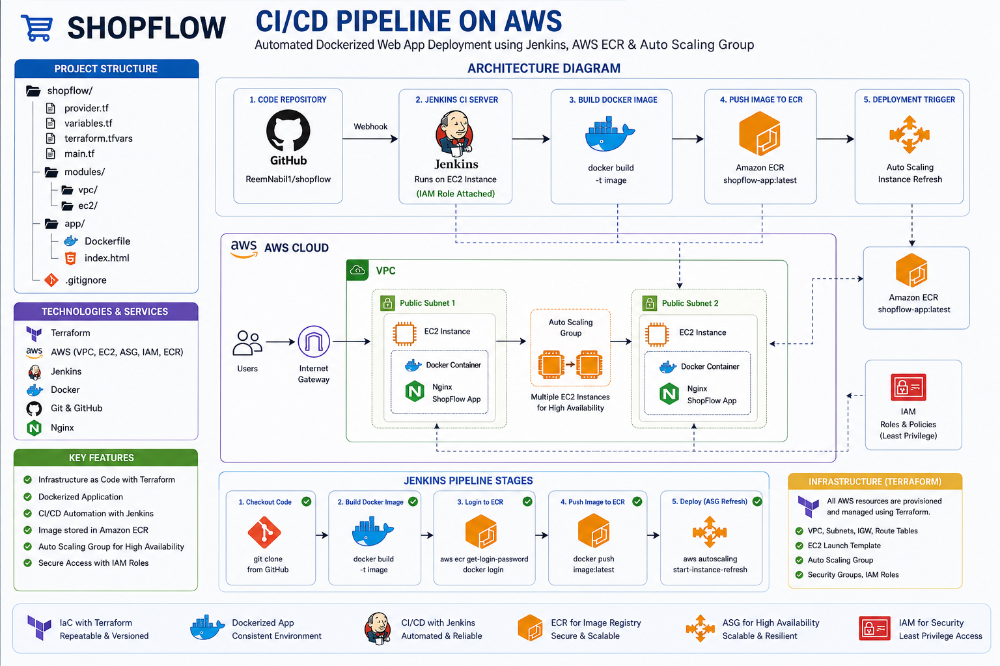

# ShopFlow – End-to-End DevOps CI/CD Pipeline on AWS

An end-to-end DevOps project demonstrating automated infrastructure provisioning and scalable application deployment on AWS using Terraform, Jenkins, Docker, and Auto Scaling Groups.

The project showcases a production-style CI/CD workflow with Infrastructure as Code (IaC), containerization, automated deployments, and scalable AWS infrastructure.

---

# Deployment Workflow

GitHub → Jenkins → Docker Build → Amazon ECR → Auto Scaling Group Instance Refresh → EC2 Deployment

---

# Project Overview

ShopFlow is a lightweight containerized web application deployed automatically through a Jenkins CI/CD pipeline.

The infrastructure is provisioned entirely using Terraform and deployed on AWS.

The pipeline performs:

1. Pull code from GitHub
2. Build Docker image
3. Push image to Amazon ECR
4. Trigger Auto Scaling Group Instance Refresh
5. Deploy latest application version automatically

---

# Architecture

The project infrastructure is provisioned entirely using Terraform using a modular architecture approach.

## Main Components

- GitHub Repository
- Jenkins CI/CD Server
- Docker
- Amazon ECR
- AWS VPC
- Public & Private Networking
- EC2 Instances
- Auto Scaling Group
- Launch Template
- IAM Roles
- Security Groups

---

# Architecture Diagram



---

# Project Structure

```bash
shopflow/
│
├── provider.tf
├── backend.tf
├── variables.tf
├── terraform.tfvars
├── main.tf
├── outputs.tf
│
├── modules/
│   ├── vpc/
│   │   ├── main.tf
│   │   ├── variables.tf
│   │   └── outputs.tf
│   │
│   ├── ec2/
│   │   ├── main.tf
│   │   ├── userdata.sh
│   │   ├── variables.tf
│   │   └── outputs.tf
│
├── app/
│   ├── Dockerfile
│   └── index.html
│
├── Jenkinsfile
│
└── .gitignore
```

# Technologies Used


| Tool               | Purpose                      |
|--------------------|------------------------------|
| Terraform          | Infrastructure as Code (IaC) |
| Jenkins            | CI/CD automation             |
| Docker             | Containerization             |
| Amazon ECR         | Docker image registry        |
| AWS EC2            | Compute instances            |
| Auto Scaling Group | Scalable deployments         |
| IAM Roles          | Secure AWS authentication    |
| GitHub             | Source code management       |
| Nginx              | Web server                   |

---


# AWS Infrastructure

Terraform provisions:

- VPC
- Public Subnet
- Private Subnet
- Internet Gateway
- NAT Gateway
- Route Tables
- Security Groups
- EC2 Instances
- IAM Roles
- Launch Template
- Auto Scaling Group

---

# Docker

The application is containerized using Docker and served through Nginx.

## Dockerfile

```dockerfile
FROM nginx:latest

COPY index.html /usr/share/nginx/html/index.html
```
# EC2 Bootstrap Automation

EC2 instances are automatically configured during launch using User Data scripts that:

- Install Docker
- Authenticate with Amazon ECR
- Pull the latest Docker image
- Run the container automatically

---

# CI/CD Pipeline Flow

## 1. Developer Pushes Code

Code is pushed to the GitHub repository.

---

## 2. Jenkins Pipeline Triggered

Jenkins automatically starts the pipeline.

---

## 3. Docker Image Build

Jenkins builds the Docker image:

```bash
docker build -t shopflow-app .
```
---

## 4. Login to Amazon ECR

Using IAM Role attached to Jenkins EC2 instance:
```
```bash
aws ecr get-login-password --region us-east-1
```
---

## 5. Push Image to ECR

```bash
docker push <ECR-REPOSITORY>
```
---

## 6. Deploy via Auto Scaling Group

Jenkins triggers:

```bash
aws autoscaling start-instance-refresh
```
This refreshes EC2 instances with the latest Docker image automatically.

---
## Why Instance Refresh?
Instead of manually recreating EC2 instances, the project uses Auto Scaling Group Instance Refresh to:

  -Automatically replace old instances
  -Pull the latest Docker image
  -Reduce downtime
  -Improve deployment reliability
  -Support rolling deployments
